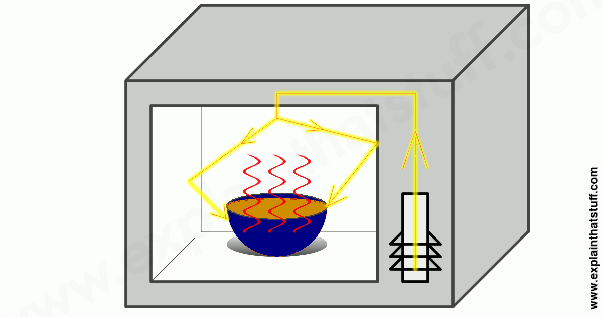

# Introdução
Uma onda é, em um grandessíssimo resumo, a propagação de um movimento-- ou melhor dizendo-- de sua energia no ambiente com uma velocidade constante.  
É definida, vetorialmente, pelas seguintes variáveis: 
- $\gamma$ (Amplitude, `ℝ`);
- $\lambda$ (Comprimento de onda, $m$);
- $t$ (Período, $s$);
- $f$ (Frequência, $Hz$); 
Vale lembrar que uma onda **nunca transportará nada além de energia**, pois é, simplesmente, uma perturbação no ambiente.  
Dois ótimos exemplos de onda são ondas de choque (fig. I) e ondas eletromagnéticas (fig. II), que estarei representando abaixo:  

Tanto o primeiro exemplo quanto o segundo são ondas tridimensionais, ou seja, ao invés de moverem a massa ao seu redor em apenas uma ou duas dimensões, acabam por movê-la em três dimenções ao perturbar o ambiente por completo.  
O diferencial aqui é de que enquanto a fig. II trata apenas de ondas magnéticas, a fig. I é uma onda de choque, feita por um conjunto de perturbações mecânicas.  
No tocante de ondas tridimensionais ainda podemos citar que a intensidade da onda diminui pelo quadrado da distância, o que podemos representar com `d ⇒ r=d^2`, onde `d` é a distância que implica no valor de `r`, que é a intensidade reduzida.  
Isso se dá ao fato do campo vetorial de ondas tridimensionais ser esférico, ou seja, partindo da premissa que a área de uma esfera aumenta pelo quadrado do raio, a intensidade da onda diminui com o quadrado deste raio.  
Já, no caso de uma onda unidimensional, de qual tipo iremos nos aprofundar, a intensidade de onda equivale proporcionalmente ao trabalho da amplitude, à velocidade da onda e ao trabalho da frequência, considerando que essa onda seja progressiva e harmônica.  

Depois desta breve introdução, iremos começar com os básicos para que possa se entender o assunto em si.