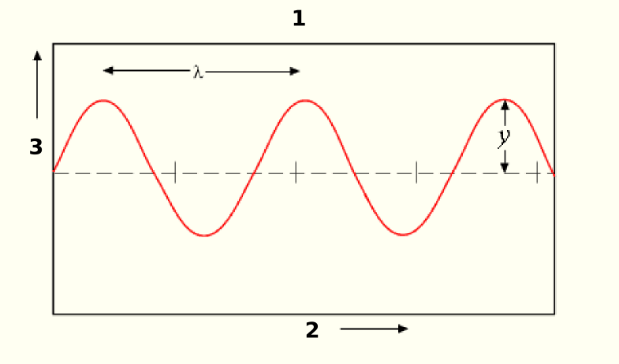

# Conciliando prática e teoria: simulações da PhET

A pedido do profº Leandro, para esse trabalho, utilizamos o simulador de ondas da Universidade do Colorado (PhET), que pode ser encontrado em [phet.colorado.edu](https://phet.colorado.edu/pt_BR/simulation/wave-on-a-string).
Aqui vão nossos resultados:
| Nº 	| Arquivo do anexo 	| Modo      	| Amplitude (γ) 	| Amortecimento (1-10) 	| Frequência 	| Tensão (1-3) 	|
|----	|------------------	|-----------	|--------------	|----------------------	|------------	|--------------	|
| 1  	| fig3.jpg         	| Oscilador 	| 0.00 cm      	| médio (5)            	| 0.00 Hz    	| alta (3)     	|
| 2  	| fig4.jpg         	| Oscilador 	| 0.47 cm      	| médio (5)            	| 0.00 Hz    	| alta (3)     	|
| 3  	| fig5.jpg         	| Oscilador 	| 0.62 cm      	| médio (5)            	| 1.52 Hz    	| alta (3)     	|
| 4  	| fig6.jpg         	| Oscilador 	| 0.62 cm      	| médio (5)            	| 3.00 Hz    	| alta (3)     	|
| 5  	| fig7.jpg         	| Oscilador 	| 1.25 cm      	| médio (5)            	| 3.00 Hz    	| alta (3)     	|
| 6  	| fig8.jpg         	| Oscilador 	| 1.25 cm      	| médio-elevado (6)    	| 3.00 Hz    	| baixa (1)    	|

## Acertando as contas: o que cada variável das que compõem vetorialmente uma onda significam, afinal?
  
Creio que agora seja a hora certa para explicar a função de cada uma das variáveis que citei anteriormente, na nossa introdução.
- $\gamma$ (Amplitude, `ℝ`);  
	-> É basicamente a medida da magnitude de uma perturbação.  
		A sua unidade de medida física varia de acordo com o tipo de onda, por isso deixamos `ℝ` como unidade, afinal esta varia, logo indicamos que é apenas um número real.  
- $\lambda$ (Comprimento de onda, $m$);  
	-> O comprimento de onda é basicamente o que o nome diz: o comprimento da onda, ou seja, a distância entre dois vales e duas cristas.  
- $t$ (Período, $s$);  
	-> O período, indicado pela variável $t$, é o tempo de um ciclo completo da oscilação de uma onda. É medida em segundos.  
		Estou citando-a antes da frequência pois ela é a base da "mini-equação" que usamos para descobrir a frequência de fato.  
- $f$ (Frequência, $Hz$); 
	-> A frequência é o exato oposto do período.  
		Dá-se pela divisão de `1` por `t` (se lembra da variável de período?) e ela, ao menos nessa fórmula, sempre será expressa em Hertz.

## Explicando porquê cada onda se comportou de tal jeito nas figuras
Irei explicar na ordem da tabela, para ficar mais simples e não tão redundante.    

1ª rodada:    
Nós configuramos no modo Oscilador, com amplitude nula, amortecimento médio, frequência nula e tensão alta.
Por não termos nenhuma amplitude, nem frequência e estarmos com a tensão no máximo, não tivemos nenhuma oscilação. Logo, tivemos apenas uma corda estática.
O oscilador simplesmente não girou (por conta da frequência nula), logo não houve perturbação e, sem perturbação, sem onda.  

2ª rodada:  
A única diferença em relação à primeira rodada que tivemos, por conta da amplitude definida para 0.47 cm, foi a corda gerando um ângulo agudo em relação com a linha imaginária de 90°.  

3ª rodada:  
Com amplitude 0.62 cm e frequência de 1.52 Hz-- nós conseguimos uma onda estável, constante e elegante. De certa forma, a amplitude "casou" com a frequência.  

4ª rodada:
Nessa rodada, praticamente, duplicamos a frequência-- de 1.52 Hz para 3.00 Hz-- o que gerou ondas extremamente agitadas que não conseguiam manter a mesma amplitude por mais de uma oscilação.

5ª rodada:
Nós configuramos a amplitude para 1.25 cm e a frequência se manteve a mesma da 4ª rodada. Os resultados foram semelhantes, em suas devidas proporções de velocidade e tamanho, aos da terceira rodada, afinal aumentamos a frequência junto com a amplitude.  

6ª rodada:
Mantivemos os mesmos valores de antes, apenas alterando o amortecimento de 5 para 6 e a tensão de 3 para 1. As curvas se tornaram tão agitadas que pareciam mais triângulos isóceles do que curvas propriamente ditas.  